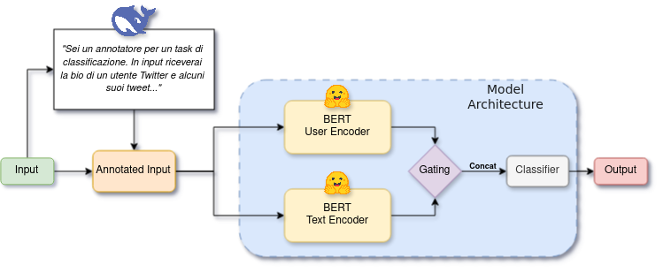

# [Multipride Task - EVALITA 2026](https://multipride-evalita.github.io/)

> [!WARNING]
> **Dataset access:** Since the task organizers decided not to release the dataset, this repository contains a mock dataset to ensure the code runs properly. If you have any questions regarding this matter, please contact the authors of this work.

## Task Description
This project addresses the Multipride challenge, a binary classification task where systems must identify whether a term related to the LGBTQ+ context is used with **reclamatory** intent.

The goal is to detect instances where potential slurs or derogatory terms are used *non-discriminatorily*, specifically as a form of self-identification or to express community belonging.

The challenge consists of two subtasks:

### Task A
In this subtask, the model has access **only to the tweet text**.
Participants can approach the task in one of two settings:

*   **Constrained:** Additional training data is **not** allowed. However, external resources (e.g., lexicons) may be used.
*   **Unconstrained:** Participants **may** use additional external training data. This choice **must be explicitly declared** upon submission.

Task A includes datasets in three languages: **Italian**, **English**, and **Spanish**. While participants are encouraged to train multilingual systems by combining datasets, there is no official multilingual leaderboard.

### Task B
In this subtask, the model is provided with the **user bio** as contextual information, in addition to the tweet text.

Task B is available only for **Italian** and **Spanish**.

---

## Our Contribution
We focused primarily on **Task B** by developing a *dual encoder* architecture. This model employs gated feature fusion to combine the information derived from a custom *User Encoder* and *Text Encoder*.

### User Encoder
Our User Encoder is built upon the hypothesis that a user's personality and identity strongly influence the likelihood of reclamatory intent. Specifically, we assume that a user who identifies as part of the LGBTQ+ community is more likely to use slurs for reclamation purposes compared to users who do not.

To construct this encoder, we used an external Large Language Model (DeepSeek) to annotate the training data (tweet + bio). The LLM was tasked with labeling users based on whether they appeared to be part of the LGBTQ+ community.

> [!NOTE]
> **Ethical Consideration:** We acknowledge that this labeling process raises ethical concerns. The objective of this annotation is **not** to identify or "out" LGBTQ+ users based on their writing style. Rather, this step is strictly necessary to provide our User Encoder with a ground truth for training, allowing it to generate a richer latent representation of the user profile.

Once the data was labeled, we trained the User Encoder. The goal was not to create a perfect user classifier, but to produce a model capable of generating high-quality user encodings.

### Text Encoder
Our Text Encoder is trained using the same methodology and architecture as the User Encoder, but it is supervised using the official ground truth labels provided by the challenge organizers.

### Feature Fusion
To perform the final classification, our architecture takes the hidden states from both encoders and weights them via a gating mechanism to create a fused hidden state. A final classifier processes this fused representation to generate the prediction.

*Further details can be found in the associated paper https://arxiv.org/abs/2602.12818*

## Final Considerations
We believe that user *bios* contain intrinsically richer information than tweets alone. Consequently, we focused exclusively on **Task B** and did not apply this pipeline to Task A.
